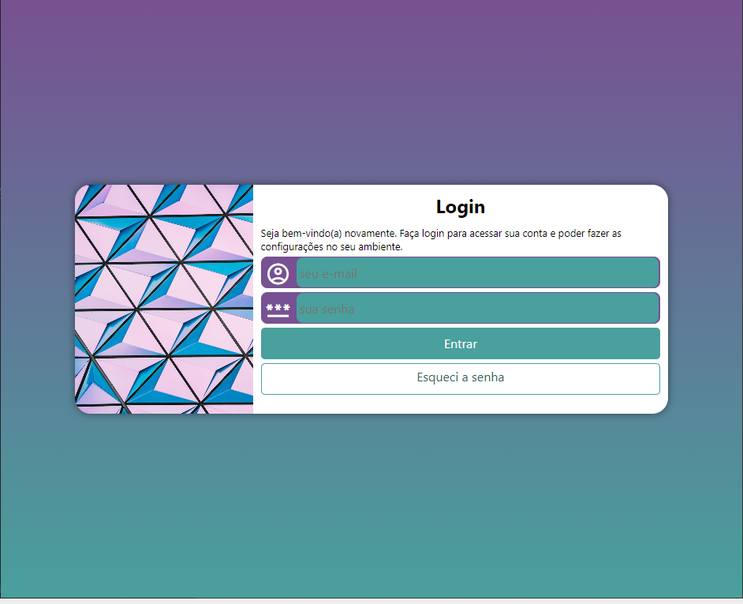
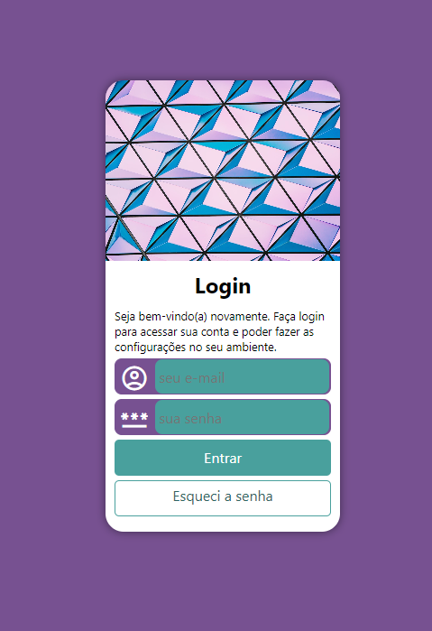
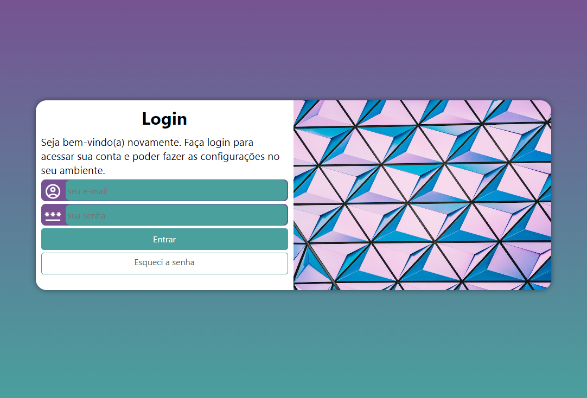

# Tela de login responsiva

 <a href="https://alessandraromualdo.github.io/tela-login/"> Acesse aqui</a>
 

 

 
Foi utilizado nesse projeto

 
 -HTML
 
 -CSS
 
 
Tela de login responsiva com mobile first, meida query para outras telas

 
Formulário com requerimentos e verivicação de requisitos

 
 

 

 
 
 

